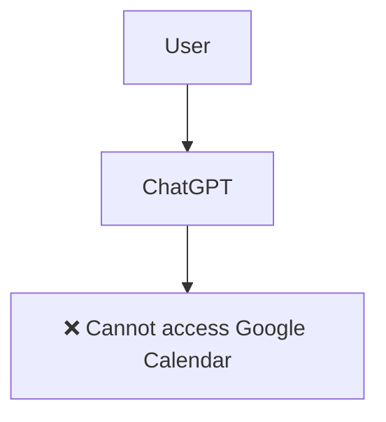
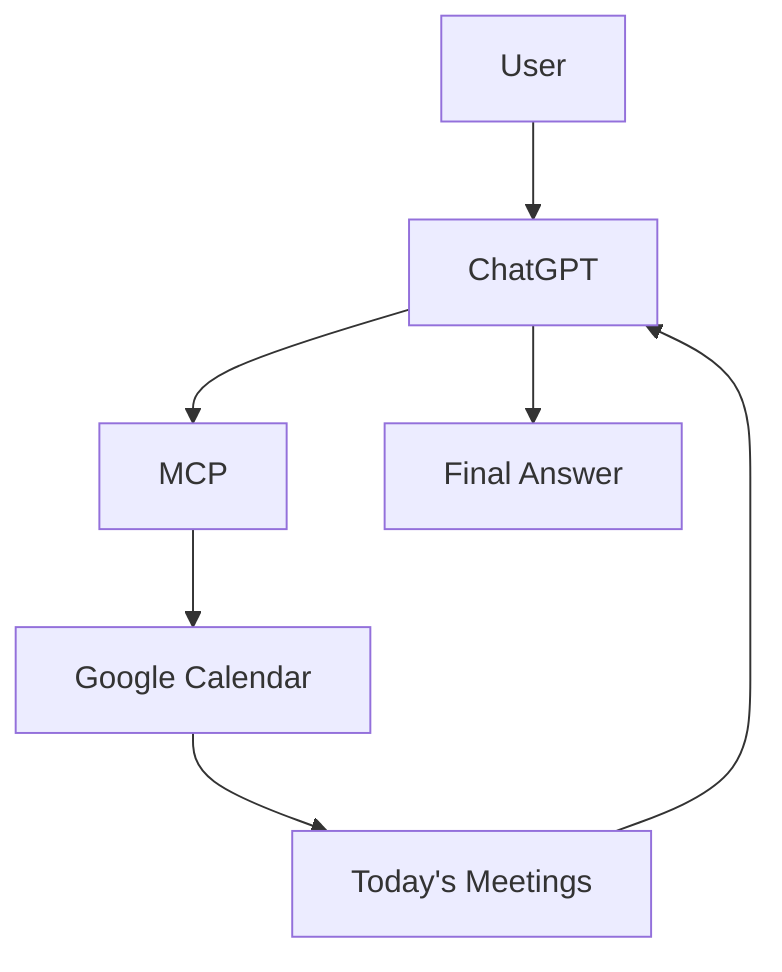
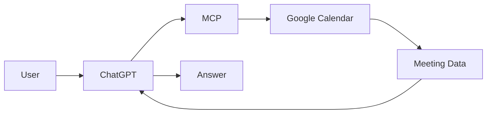
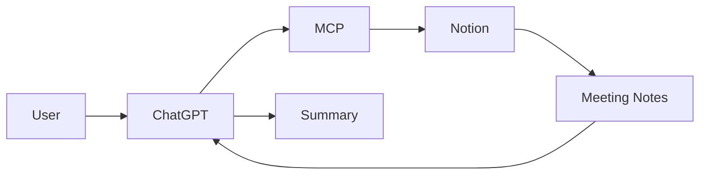
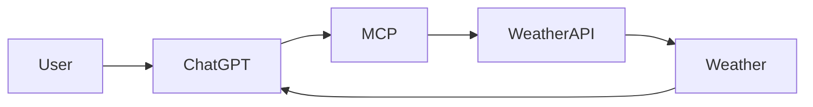
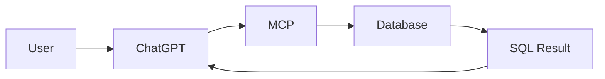
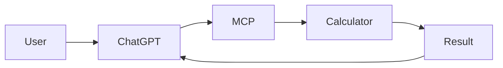
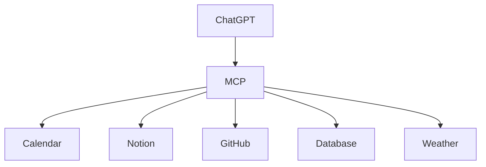
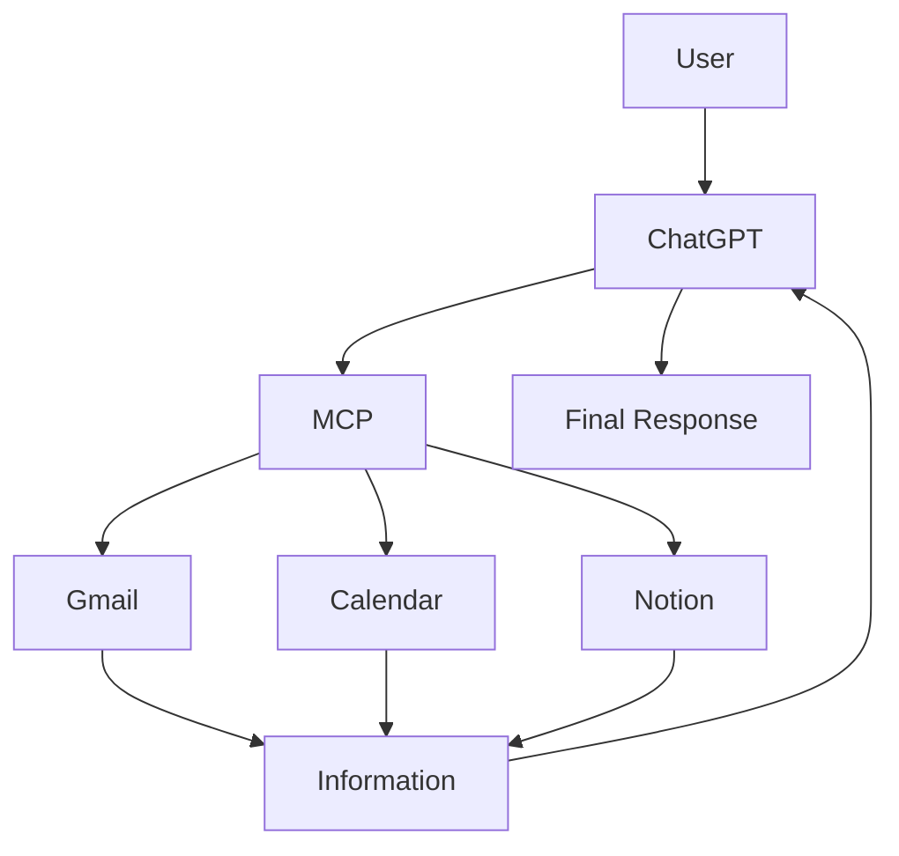

```{=html}
<p align="center">
```
``{=html}
```{=html}
</p>
```
```{=html}
<h1 align="center">
```
🚀 Model Context Protocol (MCP)
```{=html}
</h1>
```
```{=html}
<p align="center">
```
`<b>`{=html}The Universal Communication Standard for AI
Applications`</b>`{=html}
```{=html}
</p>
```
```{=html}
<p align="center">
```


```{=html}
</p>
```

------------------------------------------------------------------------

# 📖 What is MCP?

> \[!NOTE\] **Model Context Protocol (MCP)** is an open standard that
> enables AI applications to communicate with external tools, data
> sources, and services using one standardized protocol.

## 💡 Simple Definition

> **Think of MCP as a USB‑C port for AI.**

Just as USB‑C allows one laptop to connect to many devices, MCP allows
one AI application to connect to many external systems.

  USB-C World         MCP World
  ------------------- ---------------------
  💻 Laptop           🤖 AI Application
  🔌 USB-C Port       🔗 MCP
  ⌨️ Keyboard         🛠️ Tool
  🖱️ Mouse            🛠️ Tool
  💾 External Drive   🗄️ Database
  🖥️ Monitor          ☁️ External Service

------------------------------------------------------------------------

# ❌ Without MCP



**Question**

> What meetings do I have today?

**Answer**

ChatGPT cannot answer because it has no connection to your Google
Calendar.

------------------------------------------------------------------------

# ✅ With MCP



Now ChatGPT can access external information and answer correctly.

------------------------------------------------------------------------

# 🌍 Real-World Examples

  Service               User Request                   Result
  --------------------- ------------------------------ ------------------
  📅 Google Calendar    Do I have meetings tomorrow?   Meeting schedule
  📝 Notion             Summarize my notes             AI summary
  🌦️ Weather API        Weather in Karachi?            Live weather
  🗄️ Company Database   Employees joined this month?   SQL results
  🧮 Calculator         Solve complex math             Exact answer

## Google Calendar Flow



Example:

-   10:00 AM --- Client Meeting
-   3:00 PM --- Doctor Appointment

## Notion



## Weather API



## Company Database



Example: **42 employees joined this month.**

## Calculator



------------------------------------------------------------------------

# 🚀 Why Do We Need MCP?

## Without MCP

``` text
ChatGPT
├── Google Calendar API
├── Slack API
├── GitHub API
├── Notion API
└── Dropbox API
```

Every new service needs a separate integration.

## With MCP



One protocol works with many tools.

------------------------------------------------------------------------

# 🔄 Complete Real-Life Workflow

**User Request**

> Read my Gmail, check my calendar, and create a task in Notion.



------------------------------------------------------------------------

# 🎯 Key Takeaways

> \[!TIP\] - MCP is an **open standard**. - It connects AI to external
> tools securely. - One protocol replaces many custom integrations. -
> Developers build or use an MCP server once, and any MCP-compatible AI
> application can use it.

## One-Line Definition

> **MCP is an open standard that enables AI applications to securely
> communicate with external tools, data sources, and services through
> one common protocol.**

------------------------------------------------------------------------

```{=html}
<p align="center">
```
⭐ If you found this guide helpful, consider starring the repository.
```{=html}
</p>
```
