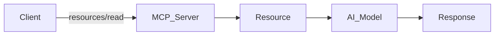
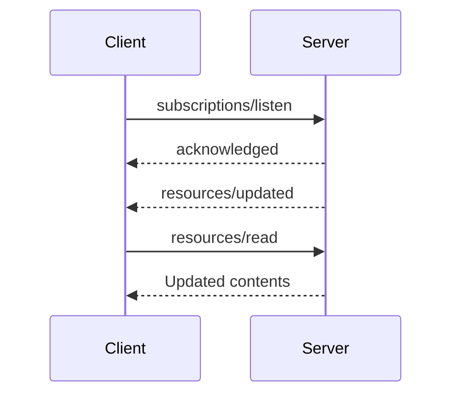
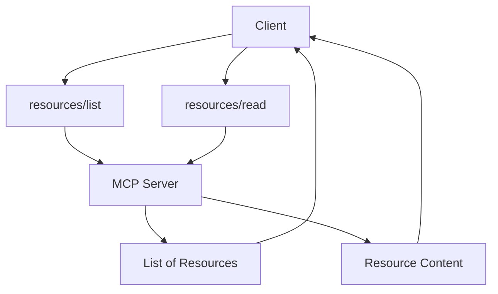
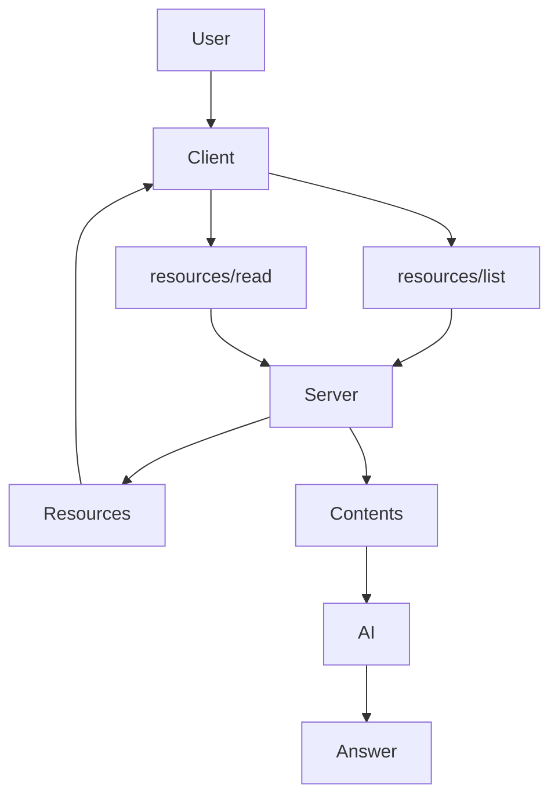

# MCP Server Features --- Resources

> **Draft Specification**

## What are Resources?

Resources allow an MCP Server to expose **data** to clients, such as:

-   Files
-   Database schemas
-   Documentation
-   Configuration
-   Application data

Every resource has a unique **URI**.



------------------------------------------------------------------------

# User Interaction Model

Resources are **application-driven**.

Applications may:

-   Show a resource picker
-   Search resources
-   Automatically include relevant resources

The protocol does **not** enforce any UI.

------------------------------------------------------------------------

# Capabilities

``` json
{
  "capabilities":{
    "resources":{
      "listChanged":true,
      "subscribe":true
    }
  }
}
```

-   **listChanged** → notify when resource list changes.
-   **subscribe** → notify when a specific resource changes.

------------------------------------------------------------------------

# Listing Resources (`resources/list`)

Clients discover available resources.

``` json
{
 "method":"resources/list"
}
```

Supports:

-   Pagination
-   Caching

Each resource contains:

-   URI
-   Name
-   Title
-   Description
-   MIME Type
-   Icons

------------------------------------------------------------------------

# Reading Resources (`resources/read`)

Read resource contents.

``` json
{
 "method":"resources/read",
 "params":{
   "uri":"file:///project/src/main.rs"
 }
}
```

Server returns text or binary content.

A single request may return multiple resources.

------------------------------------------------------------------------

# InputRequiredResult

If additional information is required before reading a resource, the
server can request more input and the client retries.

------------------------------------------------------------------------

# Resource Templates

Templates expose parameterized resources.

Example:

``` text
file:///{path}
```

Client fills `{path}` dynamically.

------------------------------------------------------------------------

# Notifications

If resources change:

``` text
notifications/resources/list_changed
```

If a subscribed resource changes:

``` text
notifications/resources/updated
```



------------------------------------------------------------------------

# Message Flow



------------------------------------------------------------------------

# Resource Data Structure

  Field         Description
  ------------- -------------------
  uri           Unique identifier
  name          Resource name
  title         Display title
  description   Description
  mimeType      MIME type
  size          Optional size
  icons         UI icons

------------------------------------------------------------------------

# Resource Content Types

## Text

``` json
{
 "uri":"file:///example.txt",
 "text":"Hello"
}
```

## Binary

``` json
{
 "uri":"file:///image.png",
 "blob":"base64..."
}
```

------------------------------------------------------------------------

# Annotations

Supported annotations:

-   audience
-   priority
-   lastModified

Used to:

-   Filter resources
-   Prioritize context
-   Show modification dates

------------------------------------------------------------------------

# Common URI Schemes

  Scheme      Purpose
  ----------- ---------------------------
  https://    Web resources
  file://     Filesystem-like resources
  git://      Git repositories
  custom://   Custom resource types

------------------------------------------------------------------------

# Error Handling

  Error                Code
  -------------------- --------
  Resource not found   -32602
  Internal error       -32603
  Legacy not found     -32002

Servers must never return an empty contents array for a missing
resource.

------------------------------------------------------------------------

# Security

Servers should:

-   Validate URIs
-   Check permissions
-   Sanitize file paths
-   Encode binary data correctly
-   Prevent directory traversal attacks

------------------------------------------------------------------------

# Complete Resource Flow



------------------------------------------------------------------------

# Summary

-   Resources provide **context data** to AI.
-   Clients discover resources with `resources/list`.
-   Read data using `resources/read`.
-   Supports templates, subscriptions, notifications, pagination and
    caching.
-   Every resource is identified by a unique URI.
