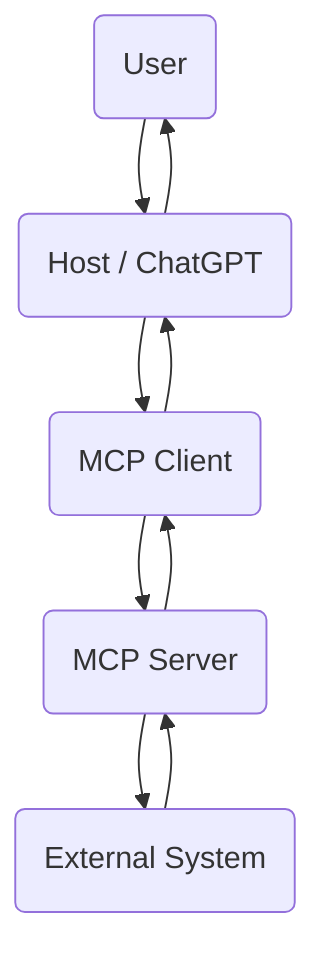
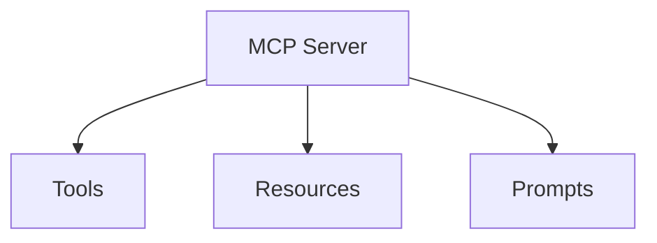
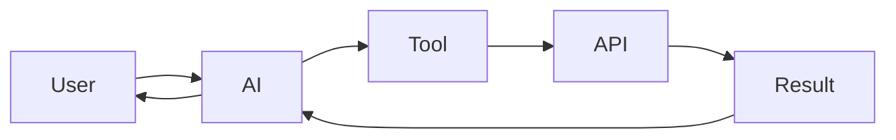
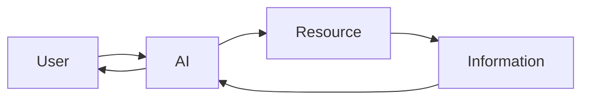
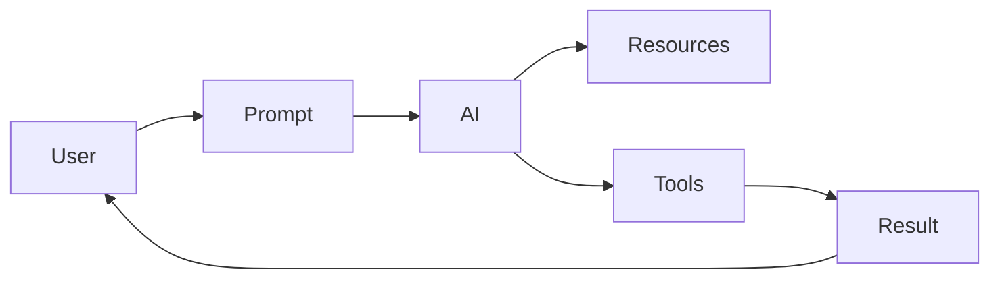
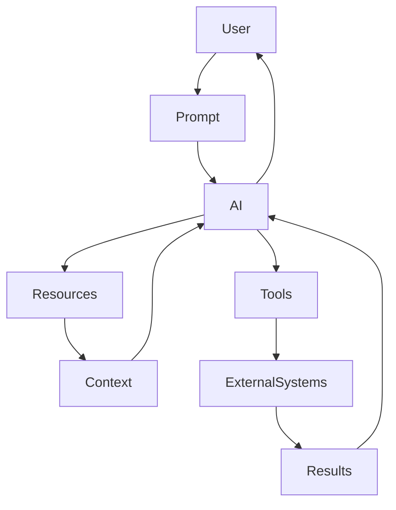

# 🚀 Understanding MCP Servers

> Beginner-friendly GitHub README with Mermaid diagrams.

## What is an MCP Server?

An **MCP Server** is a program that provides capabilities (tools, resources, and prompts) to AI applications.



## Core Server Features



# 🔨 Tools

**Tools perform actions.**

Examples:
- Search Flights
- Send Email
- Create Calendar Event
- Query Database

**Memory:** Tools = **DO**



# 📖 Resources

**Resources provide read-only information.**

Examples:
- Files
- PDFs
- Database Records
- Calendar Data

**Memory:** Resources = **READ**



Example URI:

```
file:///Documents/resume.pdf
calendar://events/2026
weather://forecast/{city}/{date}
```

# 📝 Prompts

**Prompts are reusable templates started by the user.**

**Memory:** Prompts = **GUIDE**



## Feature Comparison

| Feature | Purpose | Controlled By |
|----------|----------|---------------|
| 🔨 Tools | Perform actions | AI Model |
| 📖 Resources | Provide information | Application |
| 📝 Prompts | Reusable workflows | User |

## Complete Workflow



## Real-World Example

User: **Plan my vacation to Barcelona**

1. User selects **Plan Vacation** prompt.
2. AI reads resources (calendar, preferences, past trips).
3. AI uses tools (search flights, check weather, book hotel, create calendar event).
4. AI returns the final travel plan.

## Interview Summary

- **Tools = DO**
- **Resources = READ**
- **Prompts = GUIDE**
