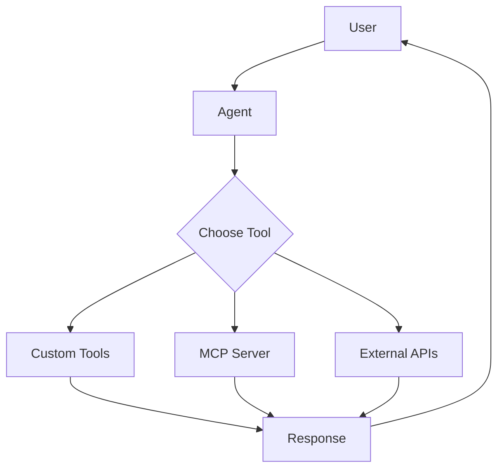

# 🤖 OpenAI Agents SDK + MCP Server

<p align="center">


</p>

<p align="center">
Building intelligent AI Agents using <b>OpenAI Agents SDK</b> with <b>MCP Server integration</b>.
</p>

---

## 🚀 About The Project

This repository contains my hands-on practice and experiments with:

* OpenAI Agents SDK
* AI Agent workflows
* MCP (Model Context Protocol)
* Custom tools
* Model integration
* Agent decision making
* Debugging real-world AI development issues

The goal of this project is to understand how modern AI agents are built, connected with external tools, and deployed in real-world applications.

---

## ✨ Features

✅ Create AI Agents using OpenAI Agents SDK
✅ Custom tool integration
✅ Multiple tool calling
✅ MCP Server connection
✅ Model client configuration
✅ Environment variable handling
✅ Agent workflow testing
✅ Real-world debugging experience

---

# 🏗️ Architecture



---

# 🛠️ Tech Stack

| Technology        | Purpose                    |
| ----------------- | -------------------------- |
| Python            | Core Development           |
| OpenAI Agents SDK | Agent Framework            |
| MCP               | Tool & Context Integration |
| LLM APIs          | AI Reasoning               |
| dotenv            | Environment Management     |

---

# 📂 Project Structure

```
OpenAI-Agents-sdk-MCP-

│
├── OpenAI_Agents_SDK_Practice
│
│   ├── config
│   │   ├── sdk_client.py
│   │   └── .env
│
│   ├── worker
│   │   └── main.py
│
├── README.md
└── requirements.txt
```

---

# ⚙️ Installation

Clone the repository:

```bash
git clone https://github.com/MuneebMalik244535/OpenAI-Agents-sdk-MCP-.git
```

Move into project:

```bash
cd OpenAI-Agents-sdk-MCP-
```

Install dependencies:

```bash
pip install -r requirements.txt
```

---

# 🔐 Environment Setup

Create a `.env` file:

```env
API_KEY=your_api_key_here
```

⚠️ Never upload API keys or secrets to GitHub.

---

# ▶️ Run Project

```bash
python worker/main.py
```

---

# 🧠 What I Learned

Through this project I explored:

* How AI Agents reason and select tools
* How MCP extends agent capabilities
* How to structure AI applications
* How to debug SDK and dependency issues
* How production AI workflows are designed

---

# 🐛 Troubleshooting Experience

During development, I faced:

```
ImportError: cannot import name AsyncOpenAI
```

and:

```
KeyError: ~TContext
```

The root cause was dependency compatibility.

Solution:

✅ Python 3.12 runtime
✅ Compatible OpenAI client version
✅ Correct Agents SDK configuration
✅ Proper environment variable loading

---

# 🔮 Future Improvements

* Add more MCP tools
* Add database integration
* Add memory system
* Build multi-agent workflows
* Deploy AI Agent application

---

## ⭐ If you find this project useful, consider giving it a star!

<p align="center">
Built with ❤️ while exploring Agentic AI
</p>
